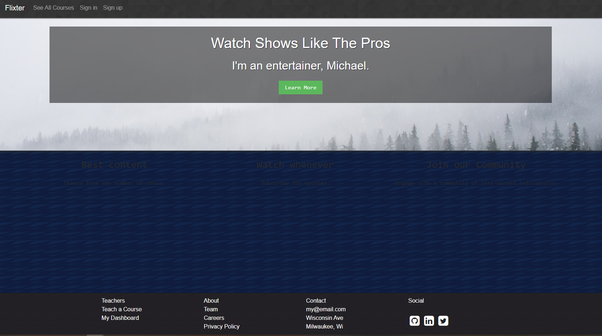
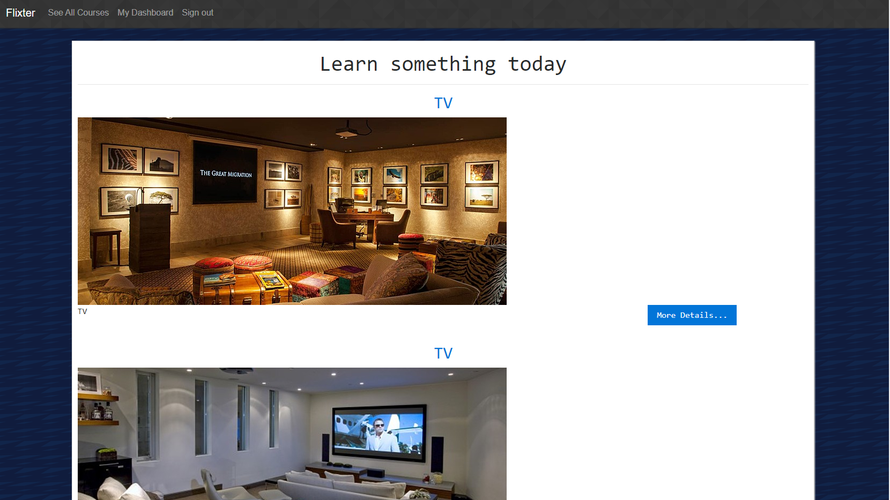
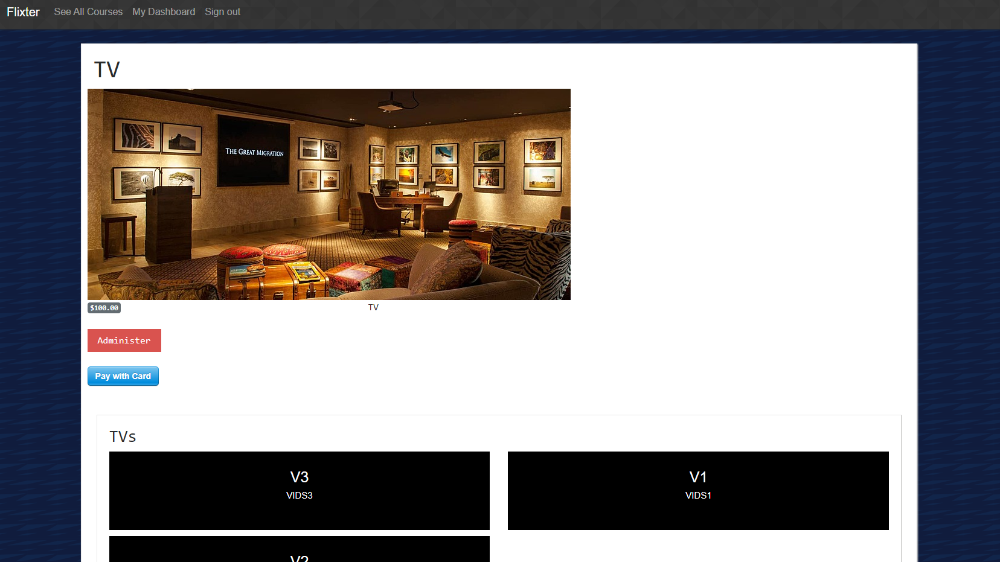
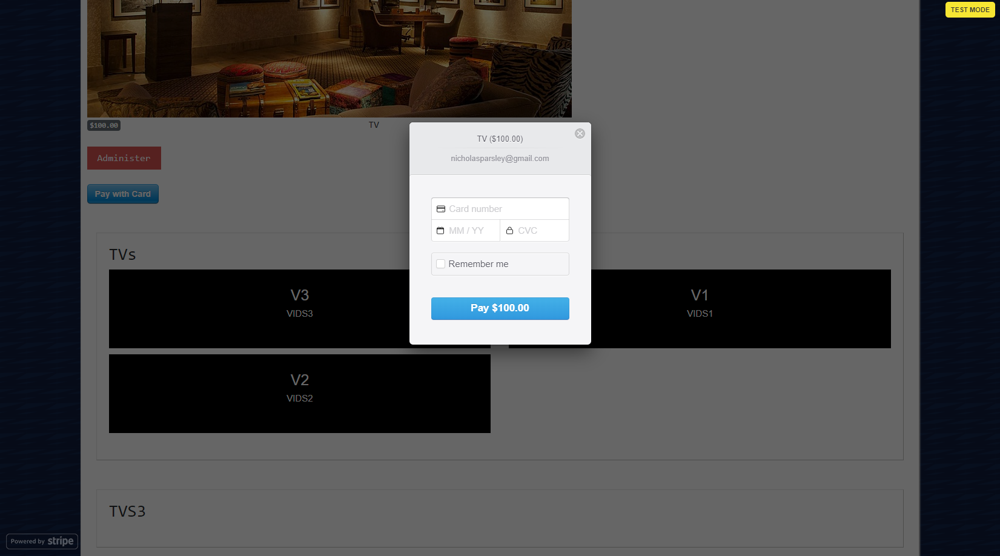
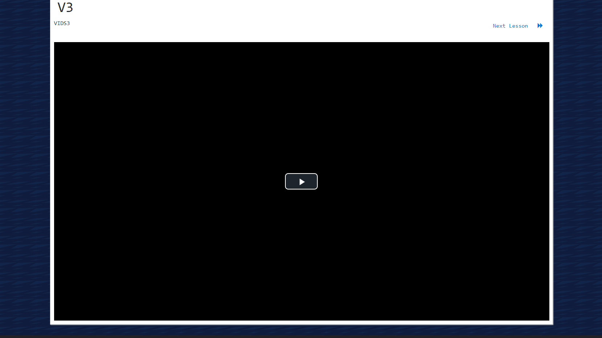
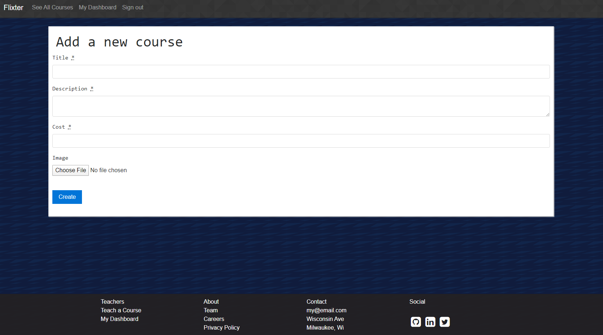
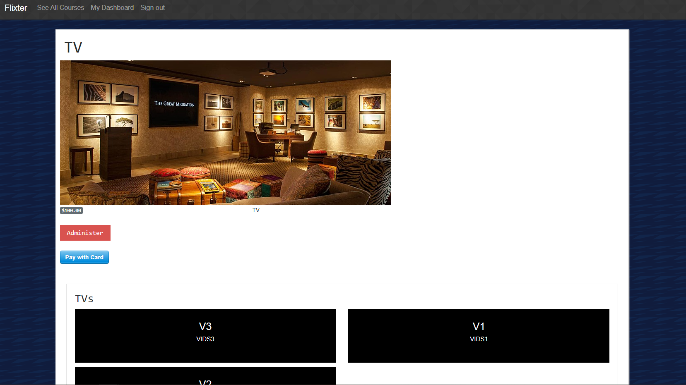
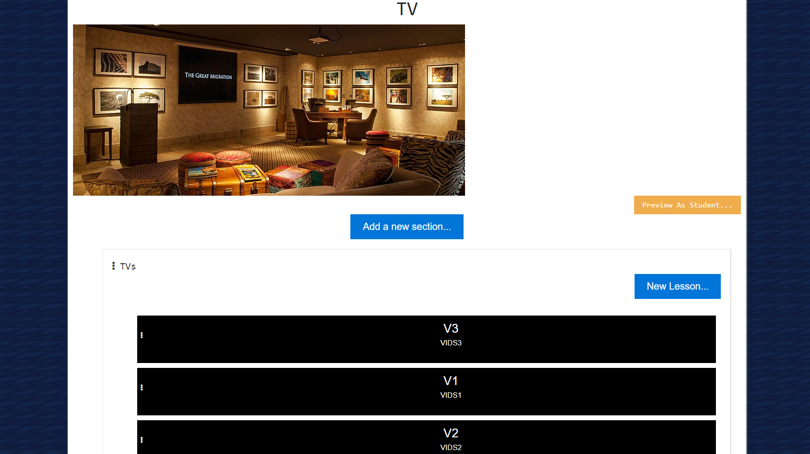
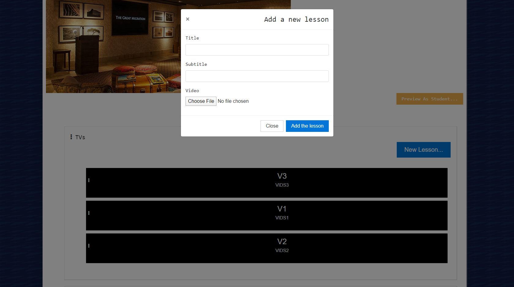
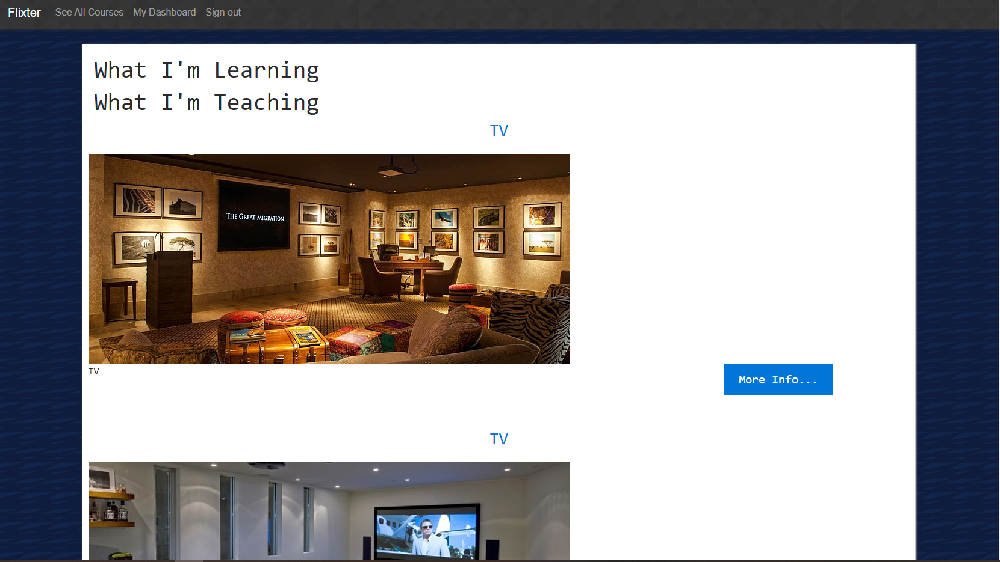

# OVERVIEW

* User-friendly video-streaming marketplace platform that features credit card payment capabilities, user role management, complex user interfaces, and advanced database
  relationships.

# HOME PAGE

* Users will be sent to the home page with the option to sign in or view a list of available courses.

# COURSES

* Users will be able to view the list of courses available.

# STUDENTS

* Clicking on a course title will direct the user to that specific course page, which includes all of the sections and lessons available for the course.
* Only signed-in users will be able to enroll in courses as students.

* Once on the selected course page, the signed-in user will have the option to purchase the course via stripe payment as a student.  All listed sections and lessons will
  become available once payment is made.
* The total price for the course will be listed along with a form to enter credit card information.

* Enrolled students can click on a lesson that will provide a video for that specific lesson.

# INSTRUCTORS

* Signed-in users will be able to teach a course by clicking on the Teach a Course link.

* Once a course is created, the signed-in user can view the course as an administer.

* The user can then edit the course they are teaching by adding new sections and lessons for the course.

# DASHBOARD

* Signed-in users can view a complete list of all courses that they are learning and teaching by clicking on the My Dashboard link.

# FOOTER

* Users can also view additional information about the platform, as well as contact information.
